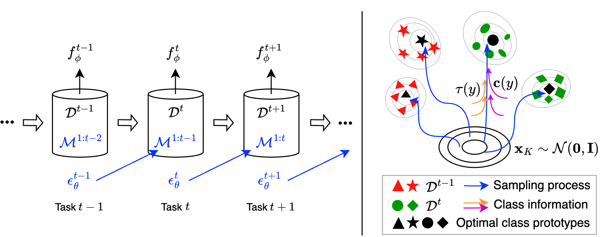

# CPDM
Implementation for <b>[Class-Prototype Conditional Diffusion Model for Continual Learning with Generative Replay](https://arxiv.org/abs/2312.06710)</b>

## Overview

In scenario of <b>Continual Class Incremental Learning (with Repetition) with Generative Replay</b>, our method <b>CPDM</b> uses Diffusion Models and Class Prototypes to generate old task samples. Prototypes learned for each class are effective tools to improve image quality.

## Prerequisites
```
conda create -n cpdm python=3.10.12 -y
conda activate cpdm
conda install pytorch==2.0.1 torchvision==0.15.2 torchaudio==2.0.2 pytorch-cuda=11.7 -c pytorch -c nvidia -y
pip install pandas matplotlib seaborn tqdm opencv-python wandb blobfile accelerate diffusers["torch"] transformers timm
conda install -c conda-forge mpi4py mpich -y
accelerate config default --mixed_precision fp16
```

## Datasets
**<font size=3>CIFAR100</font>**
```
Automatic download.
```
**<font size=3>ImageNet</font>**

You should download the ImageNet manually and process the images into "src/data/datasets/ImageNet/imagenet-1000/".
The directory is:
```
├── py-CPDM1.0                               # The main code directory
│   ├── src                
│   │  ├── data 
│   │  │  ├── datasets
│   │  │  │  ├── ImageNet
│   │  │  │  │  ├── imagenet-1000
│   │  │  │  │  │  ├── train
│   │  │  │  │  │  │  ├── n01440764
                          ...
│   │  │  │  │  │  ├── val
│   │  │  │  │  │  │  ├── n01440764
                          ...
```
Then run generate_imagenet.py and generate_imagenet_class.py in order.
```
python generate_imagenet.py
python generate_imagenet_class.py
```
**<font size=3>CORe50</font>**

The dataset will be downloaded automatically. You can also download "core50_imgs.npz", "labels.pkl","LUP.pkl" and "paths.pkl" manually into "/src/data/datasets/core/core50CIREP".

## Usage Example 
```
cd CPDM/py-CPDM1.1
bash script/alexnet/cifar100_t10.sh
```

## Code Overview
The file structure of directory is as follows:
```
.
├── py-CPDM1.0                            # The main code directory
│   ├── src                
│   │  ├── data                           # The directory contains the dataset.
│   │  ├── framework                      # The directory contains the framework of continual learning.
│   │  ├── methods                        # The directory contains the codes of CPDM.
│   │  ├── models                         # The directory contains the defined models.
│   │  ├── results                        # The directory contains the results.
│   │  ├── utilities                      # The directory contains some defined functions.
│   │  ├── config.init                    # The configuration file.
│   ├── generate_imagenet.py              # The file to convert images to 64*64.
│   ├── generate_imagenet_class.py        # The file to generate classes.
│   ├── main.py                           # The main code file.
│   ├── README.md                         # The readme file
│   ├── requirements.txt                  # The file specifies the required environments
│   ├── run_cifar100.py                   # The file of example.
```

## License
CPDM is licensed under the MIT License.
```
MIT License

Copyright (c) 2023 Alexander Tong

Permission is hereby granted, free of charge, to any person obtaining a copy
of this software and associated documentation files (the "Software"), to deal
in the Software without restriction, including without limitation the rights
to use, copy, modify, merge, publish, distribute, sublicense, and/or sell
copies of the Software, and to permit persons to whom the Software is
furnished to do so, subject to the following conditions:

The above copyright notice and this permission notice shall be included in all
copies or substantial portions of the Software.

THE SOFTWARE IS PROVIDED "AS IS", WITHOUT WARRANTY OF ANY KIND, EXPRESS OR
IMPLIED, INCLUDING BUT NOT LIMITED TO THE WARRANTIES OF MERCHANTABILITY,
FITNESS FOR A PARTICULAR PURPOSE AND NONINFRINGEMENT. IN NO EVENT SHALL THE
AUTHORS OR COPYRIGHT HOLDERS BE LIABLE FOR ANY CLAIM, DAMAGES OR OTHER
LIABILITY, WHETHER IN AN ACTION OF CONTRACT, TORT OR OTHERWISE, ARISING FROM,
OUT OF OR IN CONNECTION WITH THE SOFTWARE OR THE USE OR OTHER DEALINGS IN THE
SOFTWARE.
```